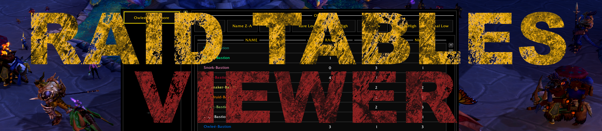
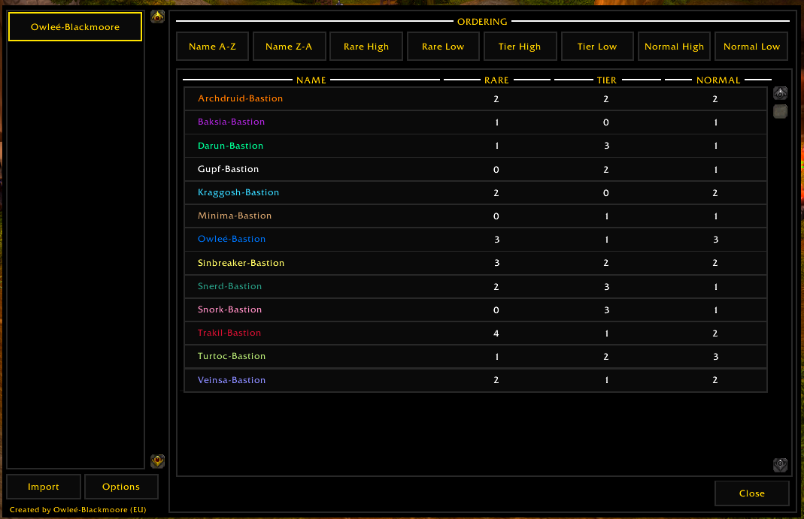
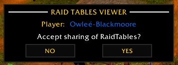
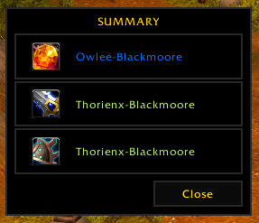

---

---

# Raid Tables Viewer
 

This is an addon for the [World of Warcraft](www.worldofwarcraft.com) game by Blizzard Entertainment. It is an addition to the [Raid Tables](https://github.com/TumbleOwlee/raid-tables) addon for raid participants. This is a cut down version of Raid Tables to show live updates and loot assignments to players. Raid leader using these tools should use Raid Tables instead. 

## UI Impressions

    <h2 align="center">Raid Overview</h2>
    

        
    

This is the default view if you toggle the addon frame. If you haven't accepted any sharing of a player, the view will be empty. Else you will see the accepted setups on the left. The button label will always be the name of the sharing player. If a setup is selected on the left side, you will see the statistics on the right side. This statistic will always be updated if the raid leader changes any value because of loot assignment or manual overwrite. This way the raid has full transperancy without dependance on external tools like Excel or Google docs.

    <h2 align="center">Accept Share Prompt</h2>
    

        
    

If any player of the raid is actively sharing its setup, you will be notified. You have to option to either accept or deny the request. If you deny, you won't get any updates, this also include loot assignments. You will have to reload in case you change your mind later since the player is on the deny list until a reload is performed.

    <h2 align="center">Accept Share Prompt</h2>
    

        
    

If you leader is sharing his setup and performs the loot assignment, you will also get the information about the performed loot assignments. This view lists all items and the corresponding winning player name.
